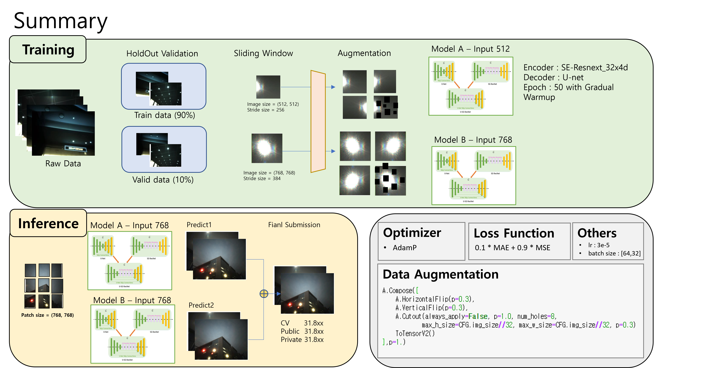

# LG_Camera_Competition

## Summary 
<!--  -->

## Data Path 

```
​```
${LG_Folder}
├── train.py
├── inference.py
├── preprocess.py
├── utils.py
├── dataloader.py
|
├── saved_models
|   └── 46e_31.9065_s.pth
|   └── 41e_32.1909_s.pth
|
├── submission
|   └── submission.zip
|
├── data
|   └── train_input_img
|   └── train_label_img
|   └── test_input_img
| 
├── environment.yml
└── submission_final.csv 
​```
```

## Environments Settings
- ### CUDA version >= 11.1
```
$ conda env create -n lg --file environment.yml
$ conda activate lg
$ pip install git+https://github.com/ildoonet/pytorch-gradual-warmup-lr.git
```

## Preprocess Script

```bash
$ python preprocess.py
```

## Training Script
```bash
$ python train.py --gpu=0,1 --img_size=512 --batch_size=64 --exp_name=512_models
$ python train.py --gpu=0,1 --img_size=768 --batch_size=32 --exp_name=768_models

optional arguments:
    --img_size:           size image input, default 512
    --num_workers:        num workers of dataloader, default 8
    --encoder_type:       backbone model, default 'se_resnext50_32x4d'
    --decoder_type:       decoder model, default 'Unet'
    --scheduler:          scheduler type, default 'GradualWarmupSchedulerV2'
    --encoder_lr:         learning rate of encoder, default 3e-5
    --min_lr:             minimum learning rate, default 1e-6
    --batch_size:         batch size training, default 32
    --weight_decay:       weight decay, default 1e-6
    --amp:                use apex, default True  
    --gpu:                gpu numbers
    --exp_name:           experiment name  
```

## Inference Script

```bash
$ python inference.py --gpu=0,1

optional arguments:
    --gpu:                gpu numbers
```

## Result


|      | **실험**                                                     | **CV** | **Public**          | **Private**         |
| ---- | ------------------------------------------------------------ | ------ | ------------------- | ------------------- |
| v1   | Baseline  (Input Resolution 512)                             | 31.52  | 30.56               | 31.12               |
| v2   | +Aug                                                         | 31.90  | 30.93               | 31.07               |
| v3   | +Aug  + AdamP                                                | 32.04  | 31.06               | 31.27               |
| v4   | +Aug  + AdamP + Loss                                         | 32.19  | 30.93               | 31.41               |
| v5   | +Aug  + AdamP + Loss + Inference Resolution (512 -> 784)     | 32.29  | 31.44               | **31.69**           |
| v6   | +Aug  + AdamP + Loss + Inference Resolution (512 -> 784) + Input Resolution (512 -> 784) | 31.98  | **31.88**           | 31.49               |
| v7   | Ensemble  (512model - v5 + 784model – v6)                    | 32.49  | **31.80  (+-0.08)** | **31.80  (+-0.08)** |

## LeaderBoard 


